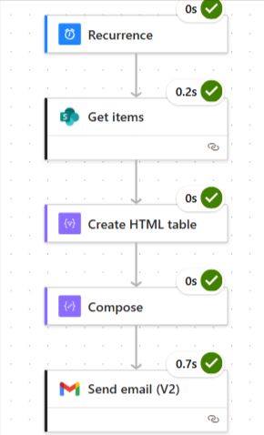

# Automated Daily Reports using Power Automate

This project demonstrates how to generate **daily automated reports** from a SharePoint list and send them via email using **Power Automate**.  

---

## 🚀 Project Overview
Managers often need to track the daily progress of their team.  
This solution:
- Collects task updates from a SharePoint list  
- Creates a clean HTML report (Title, Status, By)  
- Sends the report automatically every day via email  

---

## 🛠️ Tech Stack
- **Microsoft Power Automate** (Cloud flow)  
- **SharePoint List** (Data source for tasks)  
- **Outlook / Gmail (Send an email V2)**  

---

## 📋 SharePoint List Structure
Create a list named `DailyReports` with these columns:

| Column Name | Type        | Description                       |
|-------------|-------------|-----------------------------------|
| Title       | Single line | Task Title                        |
| Status      | Choice      | Not Started / In Progress / Done  |
| AssignedTo  | Person/Name | Assigned Employee                 |
| Priority    | Choice      | Low, Medium, High                 |
| Due Date    | Date        | deadline date                     |
---

## 🔄 Flow Steps

1. **Trigger**
   - Use **Recurrence** (set to run once daily, e.g., 6 PM).

2. **Get Items**
   - Action: **SharePoint → Get items**  
   - Site Address: your SharePoint site  
   - List Name: `DailyReports`  

3. **Create HTML Table**
   - From: output of **Select**  
   - Columns: custome
   - add comlum key and value  

4. **Compose (Style the table)**
   - Expression:
     ```powerfx
     replace(
         body('Create_HTML_table'),
         '<table>',
         '<table border="1" cellpadding="6" style="border-collapse:collapse;font-family:Arial;font-size:13px;">'
     )
     ```

6. **Send Email (Gmail → Send an email V2)**
   - To: Manager email  
   - Subject: `Daily Report - @{formatDateTime(utcNow(),'dd-MM-yyyy')}`  
   - Body (HTML):
     ```html
     <h3>Here is my today's report</h3>
     @{outputs('Compose')}
     ```

---
## Flow Diagram



## 📧 Sample Email Output

**Daily Report — 2025-09-28**

| Title                   | Status       | By          |
|--------------------------|--------------|-------------|
| Update Website Banner    | In Progress  | Rahul Singh |
| Report Automate          | Not Started  | Priya Rajput |

---

## ✅ Key Learnings
- How to fetch SharePoint list data using Power Automate  
- How to transform data with  **Create HTML Table**  
- How to style tables for email clients (inline CSS with `replace()`)  
- How to automate recurring emails  

---

## 📜 License
This project is for educational/demo purposes.
